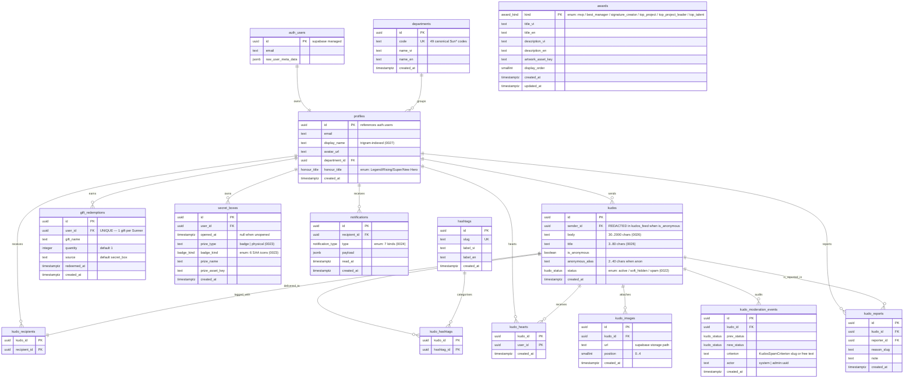

# Database Design — Sun\* Annual Awards 2025 (post-iOS fixes)

Snapshot ERD of the public schema **after migrations 0001–0028**. Source of
truth for table shapes and relationships lives in
[database-schema.sql](database-schema.sql). See
[DATABASE_REVIEW.md](DATABASE_REVIEW.md) for the rationale behind the
0022–0028 changes.

## What changed (0022–0028)

- **0022**: `kudo_status` enum + `kudos.status` column; `kudos_feed` view with
  anonymity redaction + status filter; `kudo_moderation_events` audit table.
- **0023**: `badge_kind` enum; prize columns on `secret_boxes`;
  `open_secret_box()` RPC (SECURITY DEFINER, atomic); grant-on-heart trigger.
- **0024**: `notification_type` enum; `notifications` table; 6 writer
  triggers; Realtime publication wiring.
- **0025**: `award_kind` enum; `awards` catalogue table (bilingual, seeded
  with 6 kinds).
- **0026**: length CHECKs on `kudos.body` + `kudos.title`; hashtag-cap
  trigger.
- **0027**: `pg_trgm` extension + GIN index on `profiles.display_name`;
  removed `hashtags_insert_authenticated` policy.
- **0028**: author-DELETE on `kudos`; `kudo_reports` table.

## Reading the diagram

- **`||--||`** = one-to-one (e.g. `auth_users` ↔ `profiles`)
- **`||--o{`** = one-to-many (standard FK)
- **PK** marks the primary key. Composite-PK columns on junction tables are
  also FKs to their parent tables.

## ERD

## Views (not shown in the diagram — they wrap `kudos`)

| View | Purpose | Introduced by |
|------|---------|---------------|
| `public.kudos_feed` | Anonymity-redacted + status-filtered read surface for all clients; the ONLY way `authenticated` can SELECT from `kudos` (direct SELECT is revoked) | Migration 0022 |
| `public.kudos_with_stats` | Convenience wrapper: `kudos_feed` + precomputed `hearts_count`. Used by Home teaser, Sun\*Kudos, All Kudos, and View kudo. | Updated in 0022 (previously wrapped `kudos` directly) |

## Security-relevant notes

1. **Anonymity boundary** is the `kudos_feed` view, not RLS — `sender_id` is
   `NULL`-masked server-side for non-author viewers when `is_anonymous =
   true`. Corresponding spec: [view-kudo.md](screen_specs/view-kudo.md).
2. **Secret Box prize assignment** is the `open_secret_box()` RPC, not a
   client UPDATE — clients cannot fabricate prizes. Corresponding spec:
   [open-secret-box.md](screen_specs/open-secret-box.md).
3. **Notifications** are INSERTed exclusively by trigger functions running
   as SECURITY DEFINER; clients can only `SELECT` own rows and `UPDATE
   read_at`. Corresponding spec: [notifications.md](screen_specs/notifications.md).
4. **Hashtag catalogue** (0027) is admin-curated — authenticated clients
   cannot create rows. The iOS `HashtagPickerSheet` in
   [gui-loi-chuc-kudos.md](screen_specs/gui-loi-chuc-kudos.md) should
   therefore NOT expose a "create new hashtag" affordance.
5. **Kudo immutability** is partially relaxed (0028) — the author can
   DELETE their own kudos. The `view-kudo.md` action-button matrix
   (Owner → Delete + Share; Viewer → Share + Report) is now backed by the
   `kudo_reports` table and the new DELETE policy. `UPDATE` on kudos
   remains service_role only (no client-edit flow in v1).
