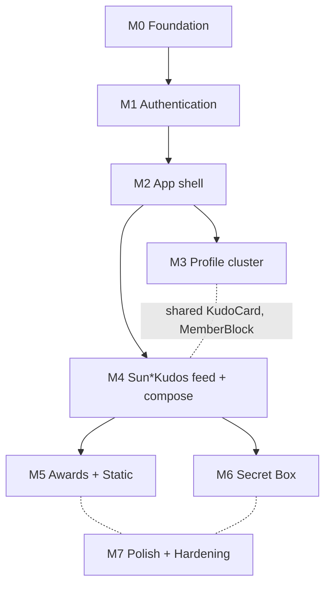

# Sun\* Annual Awards 2025 — iOS Implementation Roadmap

Milestones derived from the 16 screen specs in
[screen_specs/](screen_specs/), the [DATABASE_REVIEW.md](DATABASE_REVIEW.md)
findings, and the [api-docs.yaml](api-docs.yaml) contract.

**Strategy**: slice-based MVP-first. Each milestone is independently
shippable to TestFlight — at the end of each, a coherent slice of the app
works end-to-end against the staging Supabase project.

**Conventions**:
- **P0 = blocker** (must ship for v1); **P1 = important**; **P2 = polish**.
- Effort: **S** ≤ 1 sprint (≤ 2 weeks), **M** ≤ 2 sprints, **L** = 3+ sprints.
- "Foundation" tasks at the start of each milestone unlock the rest of
  that milestone.

---

## M0 — Project foundation (P0 · S)

**Goal**: a code-runnable iOS app with Clean Architecture skeleton, Supabase
client wired, secrets pipeline, lint + CI.

| Task | Owner | Notes |
|------|-------|-------|
| Apply DB migrations 0022–0028 to staging | Backend | Run audit queries in 0026 before VALIDATE |
| Set up SwiftPM deps: `supabase-swift`, `RxSwift`, `RxCocoa`, `RxRelay`, `RxTest` | iOS | Pin exact versions per Constitution V |
| Create folders: `Presentation/`, `Domain/`, `Data/`, `Core/`, `Resources/` | iOS | One source file per type |
| `Config/{Dev,Staging,Prod}.xcconfig` with `SUPABASE_URL`, `SUPABASE_ANON_KEY`, `ALLOWED_EMAIL_DOMAINS` | iOS | Service-role key MUST NOT appear |
| `Core/DI/` composition root (Resolver or Factory) | iOS | DI by initializer per Principle I |
| `Core/Logger.swift` with OSLog + `.private` interpolations | iOS | Principle V — never log tokens / PII |
| SwiftLint at `repo-root/.swiftlint.yml`; build phase runs it; warnings fail CI | iOS | |
| GitHub Actions: `xcodebuild test` + SwiftLint + dependency scan | DevOps | |
| Confirm `TODO(iOS_DEPLOYMENT_TARGET)` (constitution v1.0.1) — lock to iOS 17 | iOS+PM | |

**Exit criteria**: empty Xcode app builds + tests pass + CI green; Supabase
session is fetchable from a smoke unit test.

---

## M1 — Authentication (P0 · S)

**Goal**: a Sunner can sign in with Google, lands on a Home placeholder, or
sees Access denied if disallowed.

**Screens**: [Login](screen_specs/login.md), [Access denied](screen_specs/access-denied.md), [Not Found](screen_specs/not-found.md) *(reuses ErrorStateView)*.
**Spec**: [.momorph/specs/8HGlvYGJWq-authentication/spec.md](../specs/8HGlvYGJWq-authentication/spec.md).

| Layer | Deliverables |
|-------|--------------|
| **Domain** | `AuthRepository` protocol, `SignInWithGoogleUseCase`, `CheckEmailDomainUseCase`, `SignOutUseCase`, `ObserveSessionUseCase`, `AppLanguage` value, `AllowedEmailDomains` value, `Profile` entity |
| **Data** | `AuthRepositoryImpl`, `SupabaseAuthDataSource`, `KeychainSessionStorage` (`AfterFirstUnlockThisDeviceOnly`) |
| **Presentation — shared** | `TopNavigation`, `BackIconButton`, `PrimaryButton`, `ErrorStateView` (consumed by Access denied + Not Found), `LanguageSwitcherChip`, `LanguagePickerSheet`, `AppRouter`, `AppRoute` enum, `AuthStore`, `LocaleStore` |
| **Presentation — feature** | `LoginView` + `LoginViewModel` + `LoginStateAdapter`, `AccessDeniedView`, `NotFoundView` |
| **Tests** | XCTest unit (UseCases + ViewModels with `RxTest.TestScheduler`); XCUITest for P1 happy-path sign-in |

**Risks**:
- Google OAuth callback handling on iOS (`ASWebAuthenticationSession`).
- Allowlist edge-case (no email claim in token).
- `signOut()` race after disallowed domain.

**Exit criteria**: a `@sun-asterisk.com` user signs in → Home placeholder.
A `@gmail.com` user (in non-prod allowlist test config) signs in → Access
denied → tapping "Go back to Home" lands on Login.

---

## M2 — App shell (P0 · S)

**Goal**: SAA tab root with bell + countdown + tab bar; Notifications inbox
working with unread badge.

**Screens**: [Home](screen_specs/home.md), [Notifications](screen_specs/notifications.md).

| Layer | Deliverables |
|-------|--------------|
| **Shared components extracted in this milestone** | `HomeHeader`, `BottomTabBar`, `AppTab`, `TabRouter`, `KVKudosBanner`, `UnreadDotBadge`, `MarkAllReadButton`, `NotificationRowView` (typed) |
| **Domain** | `FetchHomeFeedUseCase` (combines awards teaser + kudos highlight + unread count), `ObserveUnreadNotificationsUseCase` (Realtime stream), `MarkNotificationReadUseCase`, `MarkAllNotificationsReadUseCase`, `Notification` entity (typed payloads) |
| **Data** | `NotificationRepositoryImpl`, Realtime subscription wrapper |
| **Feature** | `HomeView` (countdown + 3-card teaser placeholder), `NotificationsView` (paginated list with 7 typed rows + inline CTA on N5) |
| **Tests** | Repo integration tests against staging; ViewModel RxTest; XCUITest cold-launch shows Home with countdown |

**Mocks acceptable**: awards teaser cards link to "coming soon" alert
until M5 lands.

**Exit criteria**: cold launch → Home shows countdown + bell. Composing a
test kudo via SQL fixture → bell dot lights up + Notifications inbox
prepends N1 in real time.

---

## M3 — Profile cluster (P1 · S)

**Goal**: tap Profile tab → see your identity, badges, stats; tap a Sunner
elsewhere → see their profile.

**Screens**: [Profile bản thân](screen_specs/profile-me.md), [Profile người khác](screen_specs/profile-other.md), [Search Sunner](screen_specs/search-sunner.md) *(reused header search affordance)*.

| Layer | Deliverables |
|-------|--------------|
| **Shared components** | `MemberBlock`, `LevelBadge` (4 tiers), `BadgeGrid` (named, 6 cells), `BadgeShowcaseCell`, `StatPill`, `StatsDashboardView`, `KudoCard` (organism — list density), `TransferHeader`, `KudosFilterDropdown`, `RecentSearchesList`, `SearchBarField`, `SunnerRowTile`, `SendKudoCTA` (Profile-other only) |
| **Domain** | `FetchProfileIdentityUseCase`, `FetchBadgeCollectionUseCase` (derived from `secret_boxes` per DATABASE_ANALYSIS §7), `FetchProfileStatsUseCase`, `FetchKudosByUserUseCase`, `SearchSunnersUseCase`, recent-searches use cases |
| **Data** | `ProfileRepositoryImpl`, `KudoRepositoryImpl` extension (by-user with filter), `RecentSearchesStorage` (UserDefaults) |
| **Feature** | `ProfileMeView` + `ProfileMeViewModel` + StateAdapter; `ProfileOtherView` (subset affordances); `SearchSunnerView` with default + ActiveQuery modes |
| **Tests** | RxTest for filter switching, debounced search, anchor scroll, heart toggle |

**Acceptance**: navigating Notifications N4 (level up) deep-links to
ProfileMe `.level` anchor; N6 (badge) deep-links to `.badges` anchor.

**Exit criteria**: search opens, types "An", debounces, returns matching
profiles ≤ 200 ms; tap → ProfileOther; tap kudo on ProfileOther → ViewKudo
placeholder *(M4)*.

---

## M4 — Sun\*Kudos feed + compose (P1 · M)

**Goal**: the heart of the product — view, like, write, share Kudos.

**Screens**: [Sun*Kudos](screen_specs/sun-kudos.md) *(+ HashtagFilterSheet, DepartmentFilterSheet)*, [Gửi lời chúc Kudos](screen_specs/gui-loi-chuc-kudos.md) *(+ HashtagPickerSheet, RecipientPickerSheet, ValidationError, DefaultEmpty)*, [All Kudos](screen_specs/all-kudos.md), [View Kudo](screen_specs/view-kudo.md) *(+ AnonymousRendering)*.

### Sub-milestones

#### M4.1 — Read path (S)

| Layer | Deliverables |
|-------|--------------|
| **Domain** | `FetchHighlightKudosUseCase` (filtered + paginated), `FetchAllKudosUseCase`, `FetchKudoByIdUseCase`, `ObserveKudosTickerUseCase` (Realtime), `FetchHashtagsUseCase`, `FetchDepartmentsUseCase` |
| **Feature** | `SunKudosView` (4 sections: Compose pill, Highlight + 2 dropdowns, Spotlight Board, ALL KUDOS preview); `AllKudosView`; `ViewKudoView` with `AnonymousRendering` switch + `KudoCapabilities` |
| **Components** | `HighlightCarouselView`, `SpotlightBoardView` *(+ accessibility text-list fallback — mandatory)*, `LiveTickerView`, `TopWinnersRowView`, `FilterListSheetView` (shared by 2 dropdowns), `ImageGalleryView`, `KudoDetailView` |

#### M4.2 — Write path (S)

| Layer | Deliverables |
|-------|--------------|
| **Domain** | `SubmitKudoUseCase` (calls `create_kudo` RPC), `UploadAttachmentUseCase` (Storage), `KudosValidationError` enum, `DraftKudo` entity, `ToggleHeartUseCase`, `DeleteKudoUseCase`, `ReportKudoUseCase` |
| **Feature** | `WriteKudoView` + ViewModel + StateAdapter; `RecipientPickerSheet`, `HashtagPickerSheet` (multi-select with checkmarks); `KudoBodyEditor` (rich text + 7-button toolbar + `@mention`); `ValidationErrorBanner`; `AnonymousToggleView` |
| **Tests** | RxTest for the FSM (draft state, validation, submit, success-or-soft-hidden branching); integration test for `create_kudo` against staging |

**Risks**:
- Spotlight Board pan/zoom + Realtime ticker performance.
- Rich-text editor on iOS (`UIViewRepresentable` around `UITextView`).
- Image upload pipeline (HEIC → JPEG conversion client-side).

**Exit criteria**: end-to-end: compose → submit → Realtime prepends a
new card on Sun*Kudos; recipient receives N1 push and the kudo opens via
notification tap.

---

## M5 — Awards + Static content (P2 · S)

**Goal**: Award detail screens + the rules content.

**Screens**: [Award detail](screen_specs/award-detail.md) *(merged 6 kinds)*, [Thể lệ](screen_specs/the-le.md), [Tiêu chuẩn cộng đồng](screen_specs/community-standards.md).

| Layer | Deliverables |
|-------|--------------|
| **Domain** | `AwardKind` enum, `AwardContent` value, `FetchAwardContentUseCase`, `Mechanic` constants (`heartsPerSecretBox=5`, `totalBadgesForMysteryPrize=6`, `kudosQuocDanTopN=5`), `KudosConstraints.minCharacterCount=30` |
| **Feature** | `AwardDetailView` parameterised by `AwardKind`; `TheLeView`; `CommunityStandardsView`; shared `RulesDocumentView` consumed by both |
| **Localisation** | All static strings into `Localizable.xcstrings` (VN + EN keys for hero tiers, badge names, criteria) |
| **Tests** | Snapshot-style XCUITest for each Award kind variant |

**Exit criteria**: tapping any "Chi tiết" on Home → Award detail correct
copy + artwork; Notifications N5 inline button → Community Standards.

---

## M6 — Secret Box reveal (P2 · S)

**Goal**: open boxes earned through hearts → reveal a badge.

**Screens**: [Open secret box](screen_specs/open-secret-box.md) *(+ 3-state FSM with 7-keyframe animation)*.

| Layer | Deliverables |
|-------|--------------|
| **Domain** | `OpenSecretBoxUseCase` (calls `open_secret_box` RPC), `FetchUnopenedBoxCountUseCase`, `SecretBoxStage` FSM enum, `SecretBoxPrize` enum |
| **Feature** | `OpenSecretBoxView` (closed → tapping → revealed states); `BoxImageButton`; `PrizeRevealAnimation` (Lottie file `secret_box_reveal.json` if available, else PNG keyframes) |
| **Side-effects** | Confirm Profile bản thân stats decrement after reveal; confirm N3 grant arrives + N6 fires when 6 distinct badges collected |
| **Tests** | RPC integration test (concurrency: 2 parallel calls); reduce-motion behaviour |

**Exit criteria**: tap "Mở Secret Box" with count > 0 → reveal animation
plays + prize name shown + Profile counter updates.

---

## M7 — Polish + Hardening (P0 for ship · S)

**Goal**: production-ready quality bar.

| Area | Deliverables |
|------|--------------|
| **Accessibility audit** | VoiceOver walkthrough on every P1 screen; Dynamic Type at AX5; touch targets ≥ 44×44; Spotlight Board text-list fallback verified; live regions throttled |
| **Localisation** | VN + EN keys lock; date / number formatters use locale; relative timestamps tested in both |
| **Analytics** | All `*.viewed`, `*.tap`, `*.error` events instrumented (per-spec tables); confirm zero PII in payloads |
| **Performance** | Cold-launch < 2 s; image lazy-load; `pg_trgm` search p95 < 150 ms; Spotlight Board chip cap 50 + lazy paint |
| **Security review** | `grep` for `SUPABASE_SERVICE_ROLE` in source tree; Keychain audit; logs scrubbed of PII; ATS exceptions justified or absent |
| **Constitution check** | Each PR description includes "Constitution check: I/II/III/IV/V" line; quarterly review queued |
| **App Store assets** | Icon, screenshots (5 per device class), privacy-label answers (data collected = email + analytics buckets only) |
| **Soft launch plan** | TestFlight internal first; staged rollout to 10% on first prod release |

**Exit criteria**: ready for App Store submission; all 5 constitution
principles audited; release notes drafted.

---

## Dependency graph

M3 and M4 may run in parallel after M2 ships (different teams, but they
share `KudoCard` + `MemberBlock` — extract those at the start of M3).
M5 and M6 may run in parallel after M4. M7 always last.

---

## Indicative timeline

| Sprint (2 weeks) | Milestones |
|------------------|------------|
| **S1** | M0 + M1 (small enough to land both) |
| **S2** | M2 |
| **S3–S4** | M3 (small team) and M4.1 (large team) in parallel |
| **S5** | M4.2 (write path) |
| **S6** | M5 + M6 (parallel teams or sequential) |
| **S7** | M7 + TestFlight rollout + App Store submission |

**~7 sprints / ~14 weeks** with a 4-engineer iOS team. Add a buffer
sprint for App Store review iterations.

---

## Cross-milestone tracking

### Shared components (introduce-once, reuse-everywhere)

| Component | First introduced in | Reused by |
|-----------|---------------------|-----------|
| `TopNavigation`, `BackIconButton`, `PrimaryButton` | M1 | All authenticated screens |
| `ErrorStateView` | M1 | Access denied, Not Found |
| `LanguageSwitcherChip`, `LanguagePickerSheet` | M1 | Login, Home, Profile×2 |
| `HomeHeader`, `BottomTabBar`, `KVKudosBanner` | M2 | Home, Profile×2, Sun\*Kudos, Award detail |
| `MemberBlock`, `LevelBadge`, `BadgeGrid` | M3 | Profile×2 |
| `KudoCard`, `TransferHeader`, `ImageGalleryView` | M3 | Sun\*Kudos, All Kudos, Profile×2, View Kudo |
| `StatsDashboardView` | M3 | Profile bản thân + Sun\*Kudos ALL KUDOS section |
| `FilterListSheetView` | M4 | Sun\*Kudos hashtag/department filters + Gửi lời chúc pickers |
| `SearchBarField`, `SunnerRowTile` | M3 | Search Sunner + Gửi lời chúc recipient picker |
| `RulesDocumentView` | M5 | Thể lệ + Community Standards |

### Domain enums (lock at first use)

| Enum | Locked in | Cases |
|------|-----------|-------|
| `AppLanguage` | M0 | `.vi`, `.en` |
| `AppRoute` / `AppTab` | M1 / M2 | grows as milestones land |
| `HeroTier` | M3 | `.newHero`, `.risingHero`, `.superHero`, `.legendHero` |
| `BadgeKind` | M3 (or M5) | 6 cases per Thể lệ |
| `KudosSpamCriterion` | M4 | 10 cases per Community Standards |
| `KudosValidationError` | M4 | mirrors above + DB constraints |
| `NotificationType` | M2 | 7 cases per `notification_type` enum |
| `AwardKind` | M5 | 6 cases per `award_kind` enum |
| `SecretBoxStage`, `SecretBoxPrize` | M6 | FSM + `.badge` / `.physical` |

---

## Open decisions to resolve before each milestone

| Decision | Owner | Latest by |
|----------|-------|-----------|
| Allowlist domains (final list incl. `gmail.com` for non-prod?) | PM + DevOps | M1 |
| Avatar editor (out of v1 scope?) | PM | M3 |
| "Awards" tab destination — list screen or filter view? | PM + Design | M5 |
| Hashtag picker — allow create-new or admin-only? | PM | M4.2 — leaning admin-only based on 0027 |
| Edit kudo (post-publish) allowed? | PM | M4.2 — leaning NO (delete only) |
| Kudo-card 2 action buttons: Owner Edit/Delete vs. Share/Report? | PM + Design | M4.1 |
| Secret Box prize pool weights / "fill missing 6" rule? | PM | M6 |
| HEIC handling — convert client-side or expand bucket MIME? | iOS team | M4.2 — leaning client-side conversion |

---

## Risk register (top 5)

| # | Risk | Likelihood | Impact | Mitigation |
|---|------|:----------:|:------:|------------|
| 1 | Anonymity leak slipping through if `kudos_feed` not enforced everywhere | Med | High | M1 + M4: integration test FEED_03–FEED_07 in CI; PR-required check |
| 2 | Spotlight Board performance / accessibility | High | Med | Cap chips at 50; mandatory text-list fallback; profile early in M4.1 |
| 3 | Rich text editor + `@mention` complexity | High | Med | UIKit-based bridge; allocate full sprint for M4.2 |
| 4 | Realtime drop on long sessions | Med | Med | Polling fallback (30 s) wired in `ObserveNotificationsUseCase` |
| 5 | App Store rejection (privacy label / OAuth metadata) | Low | High | Submit to App Store review checklist before M7 close |
