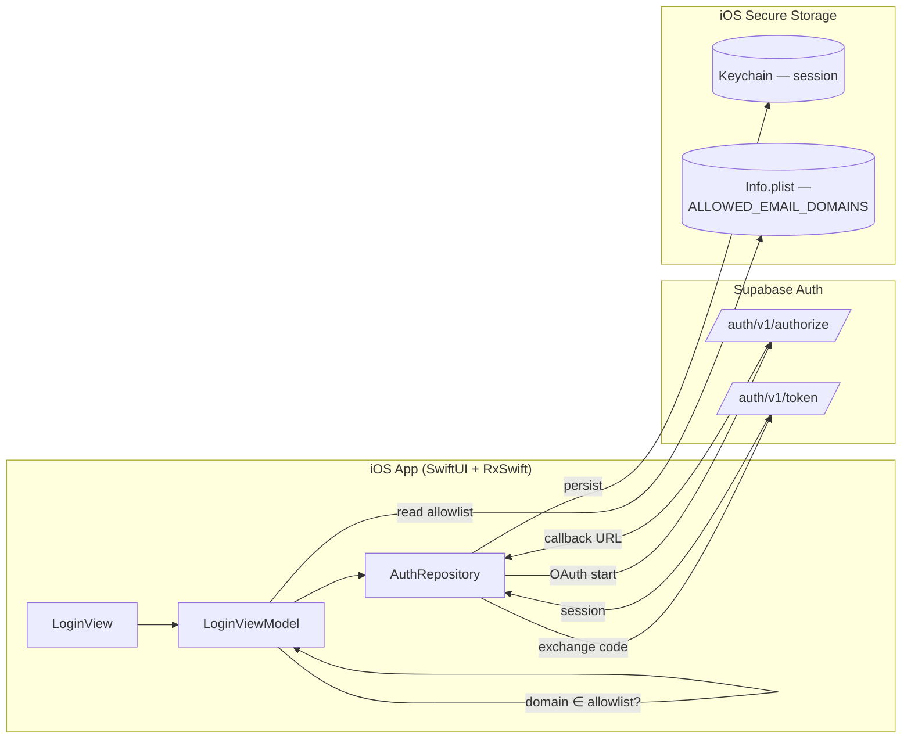

# Screen Flow Overview — Sun* SAA 2025 (iOS)

## Project Info

- **Project Name**: AIDD-SAA-2025 (Sun\* SAA 2025 iOS app)
- **Figma File Key**: `9ypp4enmFmdK3YAFJLIu6C`
- **Figma / MoMorph URL**: https://momorph.ai/files/9ypp4enmFmdK3YAFJLIu6C
- **Platform scope**: iOS (SwiftUI) — only `[iOS] …` prefixed frames are in scope for this app
- **Created**: 2026-04-24
- **Last Updated**: 2026-04-26

Notes:
- The Figma file contains both web/admin and iOS designs plus many
  atoms/variants. Only `[iOS] …` frames are tracked in this overview.
  Component/atom frames (Button, Color, Icon, StatusBar, etc.) are excluded.
- Processing follows the constitution's "ONE SCREEN AT A TIME" rule. Only the
  Login screen has been analysed so far.
- **Scope decisions (2026-04-24)**:
  - Email-domain **allowlist** is a client-side check, default
    `sun-asterisk.com` (configurable to add `gmail.com`). Not a DB table.
  - Supported **languages v1**: `VN` + `EN` only.
  - The 7 "Open secret box — Standby" frames are **animation keyframes of one
    logical screen**, collapsed into a single row below (primary frame
    `-LIblaeusT`; the other 6 IDs are captured as `variant keyframes` in that
    screen's spec).
  - The 6 `Award_*` frames (MVP / Best Manager / Signature / Top project /
    Top project leader / Top talent) share **identical layout**, collapsed
    into **1 logical screen** = `AwardDetailScreen` parameterised by
    `AwardKind`. Only artwork + description copy differ per variant.

---

## Discovery Progress

| Metric | Count |
|--------|-------|
| Total logical iOS screens | **27** |
| → Standalone specs (confirmed) | **15** |
| → Fold-in frames (sub-sheet / UI state / variant / animation) | 10 |
| → Award-detail content variants (1 spec covers 6 frames) | 5 *(the 6th is the primary)* |
| → Verify during analysis (may merge) | 2 |
| **Standalone specs already discovered** | **16** (Login, Home, Access denied, Not Found, Notifications, Profile bản thân, Profile người khác, Thể lệ, Tiêu chuẩn cộng đồng, Award detail — merged, Sun*Kudos, Gửi lời chúc Kudos, All Kudos, Search Sunner, View kudo, **Open secret box**) |
| **Standalone specs remaining to run** | **0** ✅ **Discovery complete** |
| Fold-in frames already folded | **10** (Language dropdown → login/home; Hashtag + Department filter sheets → Sun*Kudos; Recipient + Hashtag pickers + Lỗi chưa điền hết + Viết Kudo_default → Gửi lời chúc Kudos; Searching → Search Sunner; View kudo ẩn danh → View kudo; Open secret box "action bấm mở" + 7-frame Standby animation cluster → Open secret box) |

Derivation: 38 raw `[iOS] …` frames in Figma
− 6 Standby animation keyframes merged into one logical screen
− 5 Award_* duplicate layouts merged into the Award-detail spec
= **27 logical screens**.

Of these, only **15 need a standalone `screen_specs/*.md` file**; the
remaining frames are folded into a parent's spec (dropdowns, error
states, animation keyframes, award-kind variants). 2 frames still need a
quick overview check to confirm whether they merge or deserve their own
spec.

See the `Strategy` column in the Screens table for per-frame classification.

---

## Screens

**Legend for `Strategy` column:**

- ✅ **Standalone** — has its own `screen_specs/<name>.md`. Run `/momorph.screenflow` on this frame.
- ↪ **Fold → #N** (`<type>`) — do NOT run `/momorph.screenflow`. Describe this frame inside the standalone spec of row `#N` under the matching section (sub-sheet / UI state / variant / animation).
- ❓ **Verify** — quick `get_overview` needed during its parent's analysis to decide: standalone, or merge into another row.

| # | Screen Name | Frame ID | Figma | Strategy | Status | Detail File |
|---|-------------|----------|-------|----------|--------|-------------|
| 1 | [iOS] Login | `8HGlvYGJWq` | [open](https://momorph.ai/files/9ypp4enmFmdK3YAFJLIu6C/screens/8HGlvYGJWq) | ✅ Standalone | **discovered** | `screen_specs/login.md` |
| 2 | [iOS] Home | `OuH1BUTYT0` | [open](https://momorph.ai/files/9ypp4enmFmdK3YAFJLIu6C/screens/OuH1BUTYT0) | ✅ Standalone | **discovered** | `screen_specs/home.md` |
| 3 | [iOS] Access denied | `k-7zJk2B7s` | [open](https://momorph.ai/files/9ypp4enmFmdK3YAFJLIu6C/screens/k-7zJk2B7s) | ✅ Standalone | **discovered** | `screen_specs/access-denied.md` |
| 4 | [iOS] Not Found | `sn2mdavs1a` | [open](https://momorph.ai/files/9ypp4enmFmdK3YAFJLIu6C/screens/sn2mdavs1a) | ✅ Standalone | **discovered** | `screen_specs/not-found.md` |
| 5 | [iOS] Language dropdown | `uUvW6Qm1ve` | [open](https://momorph.ai/files/9ypp4enmFmdK3YAFJLIu6C/screens/uUvW6Qm1ve) | ↪ Fold → #1, #2 (*sub-sheet, reusable*) | **folded** | described in `login.md`; referenced from `home.md` → Sub-sheets |
| 6 | [iOS] Notifications | `_b68CBWKl5` | [open](https://momorph.ai/files/9ypp4enmFmdK3YAFJLIu6C/screens/_b68CBWKl5) | ✅ Standalone | **discovered** | `screen_specs/notifications.md` |
| 7 | [iOS] Profile bản thân | `hSH7L8doXB` | [open](https://momorph.ai/files/9ypp4enmFmdK3YAFJLIu6C/screens/hSH7L8doXB) | ✅ Standalone | **discovered** | `screen_specs/profile-me.md` |
| 8 | [iOS] Profile người khác | `bEpdheM0yU` | [open](https://momorph.ai/files/9ypp4enmFmdK3YAFJLIu6C/screens/bEpdheM0yU) | ✅ Standalone | **discovered** | `screen_specs/profile-other.md` |
| 9 | [iOS] Thể lệ | `zIuFaHAid4` | [open](https://momorph.ai/files/9ypp4enmFmdK3YAFJLIu6C/screens/zIuFaHAid4) | ✅ Standalone | **discovered** | `screen_specs/the-le.md` |
| 10–15 | **[iOS] Award detail (merged)** — 6 content variants | `c-QM3_zjkG` *(primary: Top talent)* | [open](https://momorph.ai/files/9ypp4enmFmdK3YAFJLIu6C/screens/c-QM3_zjkG) | ✅ Standalone (6 content variants, 1 spec) | **discovered** | `screen_specs/award-detail.md` — covers: MVP (`b2BuS8HYIt`), Best Manager (`7y195PPTxQ`), Signature 2025 — Creator (`O98TwiHaJe`), Top project (`FQoJZLkG_d`), Top project leader (`QQvsfK3yaK`), Top talent (`c-QM3_zjkG`) |
| 16 | [iOS] Open secret box | `kQk65hSYF2` | [open](https://momorph.ai/files/9ypp4enmFmdK3YAFJLIu6C/screens/kQk65hSYF2) | ✅ Standalone | **discovered** | `screen_specs/open-secret-box.md` |
| 17 | [iOS] Open secret box — action bấm mở | `KUmv414uC9` | [open](https://momorph.ai/files/9ypp4enmFmdK3YAFJLIu6C/screens/KUmv414uC9) | ↪ Fold → #16 (*UI state: tapping*) | **folded** | described in `open-secret-box.md` → UI States → `Tapping` |
| 18 | [iOS] Open secret box — Standby (merged) | `-LIblaeusT` *(primary)* | [open](https://momorph.ai/files/9ypp4enmFmdK3YAFJLIu6C/screens/-LIblaeusT) | ↪ Fold → #16 (*animation keyframes + revealed state*) | **folded** | described in `open-secret-box.md` → UI States → `Revealed (+ Animation)`. Keyframes: `IXpGakYRm5`, `_cWAEarZPi`, `scvV-OQCAJ`, `wsI6gaO_yc`, `FvTOS7oCPU`, `xptNUunBS_` |
| 19 | [iOS] Sun*Kudos | `fO0Kt19sZZ` | [open](https://momorph.ai/files/9ypp4enmFmdK3YAFJLIu6C/screens/fO0Kt19sZZ) | ✅ Standalone | **discovered** | `screen_specs/sun-kudos.md` |
| 20 | [iOS] Sun*Kudos_All Kudos | `j_a2GQWKDJ` | [open](https://momorph.ai/files/9ypp4enmFmdK3YAFJLIu6C/screens/j_a2GQWKDJ) | ✅ Standalone | **discovered** | `screen_specs/all-kudos.md` |
| 21 | [iOS] Sun*Kudos_dropdown hashtag | `V5GRjAdJyb` | [open](https://momorph.ai/files/9ypp4enmFmdK3YAFJLIu6C/screens/V5GRjAdJyb) | ↪ Fold → #19 (*filter sub-sheet*) | **folded** | described in `sun-kudos.md` → Sub-sheets → `HashtagFilterSheet` |
| 22 | [iOS] Sun*Kudos_dropdown phòng ban | `76k69LQPfj` | [open](https://momorph.ai/files/9ypp4enmFmdK3YAFJLIu6C/screens/76k69LQPfj) | ↪ Fold → #19 (*filter sub-sheet*) | **folded** | described in `sun-kudos.md` → Sub-sheets → `DepartmentFilterSheet` |
| 23 | [iOS] Sun*Kudos_Gửi lời chúc Kudos | `PV7jBVZU1N` | [open](https://momorph.ai/files/9ypp4enmFmdK3YAFJLIu6C/screens/PV7jBVZU1N) | ✅ Standalone | **discovered** | `screen_specs/gui-loi-chuc-kudos.md` |
| 24 | [iOS] Sun*Kudos_Gửi — dropdown hashtag | `aKWA2klsnt` | [open](https://momorph.ai/files/9ypp4enmFmdK3YAFJLIu6C/screens/aKWA2klsnt) | ↪ Fold → #23 (*picker sub-sheet, multi-select*) | **folded** | described in `gui-loi-chuc-kudos.md` → Sub-sheets → `HashtagPickerSheet` |
| 25 | [iOS] Sun*Kudos_Gửi — dropdown tên người nhận | `5MU728Tjck` | [open](https://momorph.ai/files/9ypp4enmFmdK3YAFJLIu6C/screens/5MU728Tjck) | ↪ Fold → #23 (*picker sub-sheet, single-select search*) | **folded** | described in `gui-loi-chuc-kudos.md` → Sub-sheets → `RecipientPickerSheet` |
| 26 | [iOS] Sun*Kudos_Lỗi chưa điền hết | `0le8xKnFE_` | [open](https://momorph.ai/files/9ypp4enmFmdK3YAFJLIu6C/screens/0le8xKnFE_) | ↪ Fold → #23 (*UI state: validation error*) | **folded** | described in `gui-loi-chuc-kudos.md` → UI States → `ValidationError` |
| 27 | [iOS] Sun*Kudos_Searching | `hldqjHoSRH` | [open](https://momorph.ai/files/9ypp4enmFmdK3YAFJLIu6C/screens/hldqjHoSRH) | ↪ Fold → #28 (*UI state: ActiveQuery — typed results + transient spinner*) | **folded** | described in `search-sunner.md` → UI States → `ActiveQuery` |
| 28 | [iOS] Sun*Kudos_Search Sunner | `3jgwke3E8O` | [open](https://momorph.ai/files/9ypp4enmFmdK3YAFJLIu6C/screens/3jgwke3E8O) | ✅ Standalone | **discovered** | `screen_specs/search-sunner.md` |
| 29 | [iOS] Sun*Kudos_Tiêu chuẩn cộng đồng | `xms7csmDhD` | [open](https://momorph.ai/files/9ypp4enmFmdK3YAFJLIu6C/screens/xms7csmDhD) | ✅ Standalone | **discovered** | `screen_specs/community-standards.md` |
| 30 | [iOS] Sun*Kudos_Viết Kudo_default | `7fFAb-K35a` | [open](https://momorph.ai/files/9ypp4enmFmdK3YAFJLIu6C/screens/7fFAb-K35a) | ↪ Fold → #23 (*UI state: default empty, anonymous off*) — verified 2026-04-24 (≥95% layout similarity) | **folded** | described in `gui-loi-chuc-kudos.md` → UI States → `DefaultEmpty` |
| 31 | [iOS] Sun*Kudos_View kudo | `T0TR16k0vH` | [open](https://momorph.ai/files/9ypp4enmFmdK3YAFJLIu6C/screens/T0TR16k0vH) | ✅ Standalone | **discovered** | `screen_specs/view-kudo.md` |
| 32 | [iOS] Sun*Kudos_View kudo ẩn danh | `5C2BL6GYXL` | [open](https://momorph.ai/files/9ypp4enmFmdK3YAFJLIu6C/screens/5C2BL6GYXL) | ↪ Fold → #31 (*variant: anonymous rendering — mask overlay + nickname*) | **folded** | described in `view-kudo.md` → Variants → `AnonymousRendering` |

### Strategy summary

| Strategy | Count | Action |
|----------|-------|--------|
| ✅ Standalone | **16** (16 discovered, 0 remaining) 🎉 | — done |
| ❓ Verify | 0 | — all resolved |
| ↪ Fold-in (sub-sheet / UI state / animation) | 11 | NO dedicated run; describe in parent's spec |
| 🎭 Content variant (Award cluster) | 5 | Covered by `award-detail.md`; no dedicated run |

*#20 All Kudos was promoted from ❓ Verify → ✅ Standalone after Sun\*Kudos
analysis found its layout < 80% similar. #30 Viết Kudo_default was
confirmed as a ↪ Fold-in (UI state: default empty) during
Gửi lời chúc Kudos analysis.*

### Fold-in details (quick reference)

| Fold-in frame | → Parent | Section in parent's spec |
|---------------|----------|--------------------------|
| #5 Language dropdown | #1 Login **and** #2 Home | Sub-sheets → `LanguagePickerSheet` |
| #17 Open secret box — action bấm mở | #16 Open secret box | UI States → `UserTappedBox` |
| #18 Open secret box — Standby (+6 keyframes) | #16 Open secret box | Animation → `BoxRevealAnimation` |
| #21 dropdown hashtag | #19 Sun*Kudos | Sub-sheets → `HashtagFilterSheet` |
| #22 dropdown phòng ban | #19 Sun*Kudos | Sub-sheets → `DepartmentFilterSheet` |
| #24 Gửi — dropdown hashtag | #23 Gửi lời chúc Kudos | Sub-sheets → `HashtagPickerSheet` |
| #25 Gửi — dropdown tên người nhận | #23 Gửi lời chúc Kudos | Sub-sheets → `RecipientPickerSheet` |
| #26 Lỗi chưa điền hết | #23 Gửi lời chúc Kudos | UI States → `ValidationError` |
| #30 Viết Kudo_default | #23 Gửi lời chúc Kudos | UI States → `DefaultEmpty` (anonymous off) |
| #27 Searching | #28 Search Sunner | UI States → `LoadingResults` |
| #32 View kudo ẩn danh | #31 View kudo | Variants → `AnonymousRendering` |

### Award content variants (Award cluster merge)

All 6 award frames are driven by the same `AwardDetailScreen` + `AwardKind`
enum. Only artwork + description copy differ — no dedicated
`screen_specs/*.md` per variant.

| Variant | AwardKind | Frame ID |
|---------|-----------|----------|
| MVP | `.mvp` | `b2BuS8HYIt` |
| Best Manager | `.bestManager` | `7y195PPTxQ` |
| Signature 2025 — Creator | `.signatureCreator` | `O98TwiHaJe` |
| Top project | `.topProject` | `FQoJZLkG_d` |
| Top project leader | `.topProjectLeader` | `QQvsfK3yaK` |
| Top talent | `.topTalent` | `c-QM3_zjkG` |

All six are described in [`screen_specs/award-detail.md`](screen_specs/award-detail.md).

### Frames to verify — 0 remaining

All verifications resolved:
- **#20 All Kudos** (2026-04-24) → ✅ **Standalone** (not fold; < 80% layout similar to Sun*Kudos).
- **#30 Viết Kudo_default** (2026-04-24) → ↪ **Fold-in** into Gửi lời chúc Kudos as UI state `DefaultEmpty` (≥ 95% layout similar).

---

## Navigation Graph (discovered so far)

```mermaid
flowchart TD
    AppLaunch([App launch]) --> SessionCheck{Valid Supabase<br/>session?}
    SessionCheck -- yes --> Home
    SessionCheck -- no --> Login

    Login["[iOS] Login"]
    Home["[iOS] Home (SAA tab)"]
    Denied["[iOS] Access denied"]
    LangSheet["[iOS] Language dropdown<br/>(folded sub-sheet)"]
    Notif["[iOS] Notifications"]
    NotFound["[iOS] Not Found"]
    Search["[iOS] Sun*Kudos_Search Sunner"]
    Kudos["[iOS] Sun*Kudos"]
    AllKudos["[iOS] Sun*Kudos_All Kudos"]
    WriteKudo["[iOS] Gửi lời chúc Kudos"]
    ProfileMe["[iOS] Profile bản thân"]
    AwardsTab[/"Awards tab root<br/>(TBC)"/]
    AwardDetail["[iOS] Award detail<br/>(merged, 6 variants)"]

    Login -->|LOGIN With Google → OAuth + domain allowlist pass| Home
    Login -->|domain NOT in allowlist| Denied
    Login -->|Tap language chip| LangSheet
    Home -->|Tap language chip| LangSheet
    LangSheet -->|Select VN / EN| Home
    Denied -->|Go back to Home button / Back icon| Login

    Home -->|Tap 🔔 bell| Notif
    Home -->|Tap 🔍 search| Search
    Home -->|FAB: Viết Kudo| WriteKudo
    ProfileMe -->|Mở Secret Box CTA| SecretBox
    Notif -->|Tap row: secretBoxGranted| SecretBox
    Home -->|Chi tiết Kudos / Tab: Kudos| Kudos
    Home -->|Chi tiết on any award card<br/>(awardKind: topTalent / topProject / topProjectLeader)| AwardDetail
    AwardDetail -->|Chi tiết CTA in Kudos block| Kudos
    Home -->|Tab: Profile| ProfileMe
    Home -->|Tab: Awards| AwardsTab
    AwardsTab -. Tap an award in the tab list .-> AwardDetail

    %% Not Found is reachable from any authenticated fetch failure
    NotFound -->|Go back to Home / Back — if authenticated| Home
    NotFound -->|Go back to Home / Back — if unauthenticated| Login
    NotFound -. from any deep-link or notification<br/>pointing at a missing resource .-> NotFound

    %% Notifications inbox — pushed from Home header bell + row-level deep navs
    Notif -->|Tap row: Kudos received / liked| ViewKudo["[iOS] Sun*Kudos_View kudo"]
    Notif -->|Tap row: Secret Box granted| SecretBox["[iOS] Open secret box"]
    Notif -->|Tap row: Level up / Badge| ProfileMe
    Notif -->|Tap row: Soft-hidden / inline CTA| CommStd["[iOS] Sun*Kudos_Tiêu chuẩn<br/>cộng đồng"]
    Notif -. Admin review row<br/>(iOS v1: likely server-filtered out) .-> NotFound
    Notif -->|Back| Home

    %% Profile tab — current user
    ProfileMe -->|Tap language chip| LangSheet
    ProfileMe -->|Tap 🔍| Search
    ProfileMe -->|Tap 🔔| Notif
    ProfileMe -->|Tap Mở Secret Box| SecretBox
    ProfileMe -->|Tap kudo card| ViewKudo
    ProfileMe -->|Tap sender/recipient avatar on a kudo card (!= me)| ProfileOther

    %% Profile người khác — other users
    ProfileOther["[iOS] Profile người khác"]
    ViewKudo -->|Tap sender/recipient (!= me)| ProfileOther
    Search -->|Tap search result| ProfileOther
    ProfileOther -->|Tap kudo card| ViewKudo
    ProfileOther -->|Gửi lời cảm ơn CTA<br/>(recipientId prefilled)| WriteKudo
    ProfileOther -.deep link :userId == auth.uid<br/>router rewrites to /me.-> ProfileMe
    ProfileOther -->|Tap language chip| LangSheet
    ProfileOther -->|Tap 🔍| Search
    ProfileOther -->|Tap 🔔| Notif

    %% Rules — static content
    TheLe["[iOS] Thể lệ"]
    Home -->|ABOUT AWARD<br/>(assumed — see the-le.md)| TheLe
    Kudos -. Rules link inside Kudos tab<br/>(to confirm) .-> TheLe
    TheLe -->|Viết Kudos| WriteKudo
    TheLe -->|Back / Đóng| Home

    %% Community Standards — static content referenced by N5 + Write Kudo
    WriteKudo -. "View standards" link<br/>(to confirm) .-> CommStd
    Kudos -. Rules link inside Kudos tab<br/>(to confirm) .-> CommStd
    CommStd -->|Back| Notif

    %% Sun*Kudos tab — feed + filters + spotlight + all-kudos preview
    Kudos -->|Compose CTA pill| WriteKudo
    Kudos -->|Tap Highlight / preview kudo card| ViewKudo
    Kudos -->|Tap Spotlight Sunner name / Top 10 Sunner| ProfileOther
    Kudos -->|Tap Spotlight inline search| Search
    Kudos -->|Tap View all Kudos| AllKudos
    AllKudos -->|Back| Kudos
    AllKudos -->|Tap kudo card| ViewKudo
    AllKudos -->|Tap sender/recipient avatar (!= me)| ProfileOther
    AllKudos -. empty-state "Viết Kudos" CTA .-> WriteKudo

    %% Write Kudo compose — reached from many entry points
    WriteKudo -->|Gửi đi → success| ViewKudo
    WriteKudo -->|Huỷ / Back| Kudos
    WriteKudo -. soft-hidden → info link .-> CommStd

    %% Search Sunner — reached from many header search icons
    Search -->|Tap result row| ProfileOther
    Search -->|Back| Home
```

Discovery complete — all 16 standalone iOS screens present in the graph above.

---

### Navigation Graph Audit (2026-04-24)

Cross-referenced every outgoing edge declared in the 16 `screen_specs/*.md`
files against the mermaid graph. Findings below; all closable fixes have
been applied directly in the graph above.

#### ✅ Fixes applied

| # | Gap | Action |
|---|-----|--------|
| 1 | `SecretBox` node carried a stale `(pending)` label — Open secret box is now discovered | Label cleaned |
| 2 | Awards-tab root declared but had **zero** outgoing edges (tab destination was marked TBC) | Added dashed edge `AwardsTab -. Tap an award in the tab list .-> AwardDetail` |
| 3 | `AllKudos` missing the empty-state "Viết Kudos" CTA (declared in all-kudos.md) | Added dashed `AllKudos -. empty-state "Viết Kudos" CTA .-> WriteKudo` |
| 4 | `AllKudos` missing kudo-card avatar-tap → `ProfileOther` (inherited from shared `KudoCard`) | Added `AllKudos -->|Tap sender/recipient avatar| ProfileOther` |
| 5 | `ProfileMe` missing kudo-card avatar-tap → `ProfileOther` | Added `ProfileMe -->|Tap sender/recipient avatar on a kudo card| ProfileOther` |
| 6 | `ProfileOther` header affordances missing (language chip, search, bell) — shared `HomeHeader` on that screen too | Added 3 edges `ProfileOther -->|Tap language chip \| 🔍 \| 🔔|` |
| 7 | `NotFound` handled authenticated case only; unauthenticated fallback path missing (not-found.md documents both) | Split into 2 explicit edges: `Home` (auth) vs. `Login` (unauth) |
| 8 | Cruft line **"Other iOS screens will be added as each is processed."** under the graph | Replaced with a completion notice |
| 9 | Screen Group **"Sun\*Kudos (to be mapped)"** was a single placeholder row | Expanded into 6 rows matching the actual discovered specs |

#### 🟡 Residual TBC items (by design — call out to resolve later)

| Item | Source spec | Resolution plan |
|------|-------------|-----------------|
| Home `ABOUT AWARD` destination | home.md assumed "scroll anchor"; the-le.md recommends "push `[iOS] Thể lệ`" | Confirm with design; update home.md + flip the edge if needed |
| Awards tab list → AwardDetail (dashed) | award-detail.md | No Awards-tab destination frame in Figma yet; may reuse an existing list OR need a new spec |
| Kudos tab → Rules (`TheLe`) and → CommStd (dashed) | sun-kudos.md | Confirm entry points inside Kudos tab during `/momorph.specs` on `fO0Kt19sZZ` |
| WriteKudo → CommStd "View standards" inline link (dashed) | gui-loi-chuc-kudos.md | Confirm design on `PV7jBVZU1N` |

#### 🔕 Intentionally omitted from the graph (by convention)

- **Tab-bar self-taps** (Home → Home, Profile → Profile, etc. as no-ops or scroll-to-top).
- **Intra-screen scroll anchors** (`ABOUT KUDOS` on Home jumping to the Kudos section within the same screen).
- **Standard "Back" pops** that simply return to the caller — only shown where the destination is semantically meaningful (e.g. `Notif → Home`).
- **Shared-header affordances** when the destination is trivially reachable from any tab-rooted screen (e.g. `Search` is shown from Home/ProfileMe/ProfileOther/Kudos, not duplicated for every screen that includes the header).

#### 🚨 Unreachable / orphan check

Walked the graph from `AppLaunch` — all 16 standalone screens (and both
folded LangSheet + all fold-in UI-state references that matter for
navigation) are reachable. No orphan nodes.

---

## Screen Groups (provisional — refined as more screens are analysed)

### Group: Authentication
| Screen | Purpose | Entry Points | Status |
|--------|---------|--------------|--------|
| [iOS] Login | Google SSO entry | App launch, logout, expired session | discovered |
| [iOS] Access denied | Error state for email domain not in allowlist (and future generic 403) | After Login OAuth success + domain check fail | discovered |

### Group: Core App
| Screen | Purpose | Status |
|--------|---------|--------|
| [iOS] Home | SAA 2025 tab — event countdown, awards teaser, kudos teaser, FAB, bottom tab bar | discovered |
| [iOS] Notifications | Notification inbox — 7 typed rows (Kudos received / Kudos liked / Secret Box / Level up / Soft-hidden / Badge prize / Admin review) | discovered |
| [iOS] Profile bản thân | Current user profile — identity + badges + stats + kudos feed + Mở Secret Box CTA | discovered |
| [iOS] Profile người khác | Other user's profile — identity + named badge grid (REVIVAL, TOUCH OF LIGHT, STAY GOLD, FLOW TO HORIZON, BEYOND THE BOUNDARY, ROOT FUTHER) + "Gửi lời cảm ơn" CTA + received-only kudos list | discovered |
| [iOS] Thể lệ | Rules / program terms — 4 hero tiers + 6-badge system + Secret Box mechanic (5 ❤ = 1 box) + "Kudos Quốc Dân" top-5 prize + "Viết Kudos" CTA | discovered |

### Group: Awards
| Screen | Purpose | Status |
|--------|---------|--------|
| [iOS] Award detail (merged) | Single `AwardDetailScreen` parameterised by `AwardKind` — serves all 6 award categories (MVP / Best Manager / Signature 2025 — Creator / Top project / Top project leader / Top talent) | discovered |

### Group: Secret Box
| Screen | Purpose | Status |
|--------|---------|--------|
| [iOS] Open secret box | Gift/prize reveal flow — 3-state FSM (closed → tapping → revealed) with 7-keyframe reveal animation cluster; server-authoritative prize assignment via `open_secret_box` RPC | discovered |

### Group: Sun\*Kudos
| Screen | Purpose | Status |
|--------|---------|--------|
| [iOS] Sun\*Kudos | Kudos tab root — Highlight carousel + Spotlight Board + All-Kudos preview + Compose pill | discovered |
| [iOS] Sun\*Kudos_All Kudos | Full paginated feed pushed from Kudos tab | discovered |
| [iOS] Sun\*Kudos_View kudo | Single kudo detail (+ AnonymousRendering variant folded in) | discovered |
| [iOS] Sun\*Kudos_Gửi lời chúc Kudos | Compose (+ 4 fold-ins: 2 pickers, validation error, default empty) | discovered |
| [iOS] Sun\*Kudos_Search Sunner | Global Sunner search (+ ActiveQuery state folded in) | discovered |
| [iOS] Sun\*Kudos_Tiêu chuẩn cộng đồng | Community Standards rules | discovered |

### Group: Error states
| Screen | Purpose | Entry points | Status |
|--------|---------|--------------|--------|
| [iOS] Access denied | Shown when email domain fails the allowlist; also a future generic client-side 403 | After Login OAuth success + allowlist fail | discovered |
| [iOS] Not Found | Generic 404 for missing/deleted resources | Deep-link failures, stale notifications, internal navigation fetch-not-found | discovered |

Both screens use a shared `ErrorStateView` organism (same layout: title +
divider + subtitle + illustration + primary button). Introduced in
`not-found.md`; Access denied will be refactored to consume it during
implementation.

### Group: Shared UI
| Screen | Purpose | Status |
|--------|---------|--------|
| [iOS] Language dropdown | Modal sheet for language switch (VN + EN) | folded into Login + Home |

---

## API Endpoints Summary

Backend is Supabase. "API" below refers to Supabase SDK calls, Supabase Auth
endpoints, and per-feature Edge Functions where applicable.

| Endpoint / SDK call | Method | Screens Using | Purpose |
|---------------------|--------|---------------|---------|
| `supabase.auth.signInWithOAuth(.google)` | POST `/auth/v1/authorize` | Login | Start Google OAuth |
| `supabase.auth.exchangeCodeForSession(code)` | POST `/auth/v1/token?grant_type=pkce` | Login | Exchange OAuth code for session |
| `supabase.auth.getSession()` | local / `GET /auth/v1/user` | Login, Home (guard) | Detect existing session |
| `supabase.auth.signOut()` | POST `/auth/v1/logout` | Login (on allowlist deny), Profile | Clear session |
| `supabase.from("awards").select().limit(3).order("display_order")` | GET `/rest/v1/awards` | Home | Teaser: first 3 awards |
| `supabase.from("kudos_highlights").select().limit(1)` | GET `/rest/v1/kudos_highlights` | Home | Featured kudos for banner |
| `supabase.from("notifications").select(count:"exact",head:true).eq("recipient_id",uid).is("read_at",nil)` | HEAD `/rest/v1/notifications` | Home | Unread badge count |
| Supabase Realtime channel on `notifications` | WebSocket | Home, Notifications | Live unread updates + prepend on inbox |
| `supabase.from("notifications").select("*").eq("recipient_id",uid).order("created_at",desc:true).limit(20)` | GET `/rest/v1/notifications` | Notifications | Paginated inbox (keyset via `.lt("created_at", cursor)`) |
| `supabase.from("notifications").update({read_at:now}).eq("id", rowId)` | PATCH `/rest/v1/notifications` | Notifications | Mark a single row read |
| `supabase.from("notifications").update({read_at:now}).eq("recipient_id", uid).is("read_at", nil)` | PATCH `/rest/v1/notifications` | Notifications | Mark all read |
| `supabase.from("profiles").select("*, department(*), level(*)").eq("user_id", uid).single()` | GET `/rest/v1/profiles` | Profile bản thân (+ likely Profile người khác) | Load identity |
| `supabase.from("badges_owned").select("badge_id, badges(*)").eq("user_id", uid)` | GET `/rest/v1/badges_owned` | Profile bản thân | Badge collection |
| `supabase.rpc("profile_stats", { uid })` | POST `/rest/v1/rpc/profile_stats` | Profile bản thân | Aggregated stats (kudos received/sent/hearts + secret boxes opened/unopened) |
| `supabase.from("kudos").select(...).eq("sender_id" OR "recipient_id", uid)` | GET `/rest/v1/kudos` | Profile bản thân, (later) Profile người khác, Sun*Kudos feed | User's kudo feed with filter |
| `supabase.rpc("toggle_heart", { kudo_id })` | POST `/rest/v1/rpc/toggle_heart` | Profile bản thân, View kudo | Like/unlike a kudo |
| *(Option B only)* `supabase.from("awards").select("*").eq("kind", k).single()` | GET `/rest/v1/awards` | Award detail | Per-kind content (Option A: bundled in app instead) |
| *(Option B only)* `supabase.from("award_winners").select("*").eq("award_kind", k).eq("year", y)` | GET `/rest/v1/award_winners` | Award detail | Historical winners if the year-filter is dynamic |
| `supabase.from("kudos").select(...).eq("is_highlight", true)` + filters | GET `/rest/v1/kudos` | Sun*Kudos Highlight carousel | Filtered by hashtag + department |
| `supabase.rpc("spotlight_board", { limit })` | POST `/rest/v1/rpc/spotlight_board` | Sun*Kudos | Aggregated Sunner cloud data |
| Supabase Realtime on `kudos` (INSERT) | WebSocket | Sun*Kudos live ticker | Server-sanitised ticker messages |
| `supabase.from("kudos_top_winners").select(...).limit(10)` | GET | Sun*Kudos | "10 Sunner nhận quà" row |
| `supabase.from("hashtags").select(...)` | GET | Sun*Kudos hashtag sub-sheet | Populate filter options |
| `supabase.from("departments").select(...)` | GET | Sun*Kudos department sub-sheet | Populate filter options |
| `supabase.from("profiles").select(...).ilike("full_name","%q%").neq("user_id",uid).limit(20)` | GET | Gửi lời chúc recipient picker search | Search Sunners (excl. self) |
| `supabase.from("kudos").insert(draft).select().single()` | POST `/rest/v1/kudos` | Gửi lời chúc submit | Create new kudo; server may set `status='soft_hidden'` on moderation trigger |
| `POST /storage/v1/object/kudo_attachments/{uid}/{uuid}.ext` | POST | Gửi lời chúc image attach | Multipart upload to Supabase Storage |
| `supabase.from("secret_box_grants").select(count:"exact", head:true).eq("user_id",uid).is("opened_at", nil)` | HEAD `/rest/v1/secret_box_grants` | Open secret box | Unopened count (also surfaces on Profile bản thân stats) |
| `supabase.rpc("open_secret_box", {})` | POST `/rest/v1/rpc/open_secret_box` | Open secret box | **Server-authoritative prize assignment** — SECURITY DEFINER; returns `{ prize_type, prize_name, prize_asset_key, badge_kind? }` |

> The email-domain allowlist is a client-side check (see `Config/*.xcconfig`
> → `ALLOWED_EMAIL_DOMAINS`) — it does **not** translate to a backend call.
> Authoritative access control stays in Supabase RLS policies on each
> user-accessible table.

More endpoints will be added as each screen is processed.

---

## Data Flow



---

## Technical Notes

### Authentication Flow (Principle V)

- Google SSO is the only supported provider (per design).
- Supabase Auth with PKCE; `ASWebAuthenticationSession` drives the OAuth web
  step in-app.
- Session tokens stored in **iOS Keychain** with
  `kSecAttrAccessibleAfterFirstUnlockThisDeviceOnly` — never in
  `UserDefaults`.
- **Access gating** is a two-layer model:
  1. **Navigation gate (client-side)**: email-domain allowlist loaded from
     `Info.plist` (`ALLOWED_EMAIL_DOMAINS`, default `sun-asterisk.com`). On
     mismatch, the client signs out immediately and routes to
     `[iOS] Access denied`.
  2. **Security boundary (server-side)**: Supabase RLS policies on every
     user-accessible table. The allowlist is NOT a security mechanism —
     widening it never weakens data protection because RLS continues to
     constrain what any signed-in user can read/write.
- No service-role key in the iOS bundle.

### State Management (Principle III)

- Per ViewModel: RxSwift inputs (`PublishRelay`) and outputs
  (`Driver`/`Signal`).
- A thin `@MainActor` adapter converts Rx outputs to `@Published` properties
  for SwiftUI Views; Views never import `RxSwift`.
- Global `AuthStore` and `LocaleStore` hold session and language respectively.

### Routing

- SwiftUI `NavigationStack` with a typed `AppRoute` enum (`.login`, `.home`,
  `.accessDenied`, …).
- An `AppCoordinator` subscribes to `AuthStore` and resets the navigation
  stack on sign-in / sign-out. Language selection is a sheet, not a push.
- No deep-linking in v1; when added, unauthenticated deep links land on Login
  and replay after successful auth.

---

## Discovery Log

| Date | Action | Screens | Notes |
|------|--------|---------|-------|
| 2026-04-24 | Initial file list + Login analysis | [iOS] Login | Used `list_frames` + `get_overview` (depth 4). 160 total Figma frames; scope narrowed to `[iOS] …` prefix. |
| 2026-04-24 | Scope decisions applied | — | Allowlist → client-side domain check (`sun-asterisk.com`, extensible). Languages v1 → `VN` + `EN`. Secret-box 7 Standby variants merged into one logical screen. Final in-scope total: **32** logical frames. Login spec updated accordingly. |
| 2026-04-24 | Fold-in strategy classified | — | Each of the 32 frames tagged with a `Strategy` column: **20 standalone**, **10 fold-in** (dropdowns / UI states / animation keyframes / variants), **2 verify-during-analysis**. Reduces required `/momorph.screenflow` runs from 31 → **19–21**. |
| 2026-04-24 | Wave 1.1 — Home analysed | [iOS] Home | `get_overview` depth 5. Structure: header (logo + lang + search + notif bell) / hero countdown to 26/12/2025 / Root Further note / awards teaser (3 cards) / Sun*Kudos banner + CTA / FAB (Viết Kudo) / 4-tab Bar (SAA/Awards/Kudos/Profile). Folded `[iOS] Language dropdown` (uUvW6Qm1ve) → confirmed **v1 languages = VN + EN** (2 rows only). Added 8 new outbound edges. Pending verification: Search destination + Awards tab destination. |
| 2026-04-24 | Wave 1.2 — Access denied analysed | [iOS] Access denied | `get_overview` depth 5. Simple dead-end state: TopNav (Back only) + title "Access Denied" + subtitle + Not-Found illustration + primary button "Go back to Home". Zero API. Flagged UX mismatch: button label says "Home" but user is unauthenticated → MUST route to Login. Identified 2 shared components to extract: `TopNavigation` / `BackIconButton` (app-wide) and shared `ErrorStateView` layout reused by Not Found. Asset `MM_MEDIA_Not Found` shared with `[iOS] Not Found`. |
| 2026-04-24 | Wave 1.3 — Not Found analysed (Wave 1 complete) | [iOS] Not Found | `get_overview` depth 5. Structure **identical** to Access denied (same organism). Introduced shared `ErrorStateView` component in not-found.md — access-denied.md will refactor to consume it during implementation. Button on Not Found routes to **Home** (user authenticated), unlike Access denied which routes to Login. Proposed `AppRoute.notFound(source:)` with `NotFoundSource` enum for analytics. New "Error states" screen group created. **Wave 1 closed**: 4 standalone specs + 1 fold-in resolved. |
| 2026-04-24 | Wave 2.1 — Notifications analysed | [iOS] Notifications | `get_overview` depth 5. Identified **7 typed rows** (kudosReceived / kudosLiked / secretBoxGranted / levelUp / contentSoftHidden / badgeCollected / adminReviewRequest). Each type maps to a distinct `AppRoute`. Row N5 carries an inline CTA to Community Standards. Added 5 outbound edges. Raised v1 decisions: (a) admin-review row handling (recommend server-side filter), (b) Profile anchors (.level / .badges) — defer to Profile analysis. Added 3 new Supabase endpoints (paginated list + per-row PATCH + mark-all-read PATCH). Realtime channel on `notifications` reused from Home for unread count + live prepend. |
| 2026-04-24 | Wave 2.2 — Profile bản thân analysed | [iOS] Profile bản thân | `get_overview` depth 5. Profile tab root with 4 blocks: identity (MemberBlock with LevelBadge — supports multiple tiers e.g. Legend Hero + Rising Hero), badge collection (BadgeGrid), stats dashboard (kudos received/sent/hearts + secret boxes opened/unopened + Mở Secret Box CTA), and kudo list with filter (Đã nhận / Đã gửi). **Confirmed Profile anchors** from Notifications: `.level` → MemberBlock, `.badges` → IconCollection. Added 5 Supabase endpoints (profile, badges_owned, profile_stats RPC, kudos by-user, toggle_heart RPC). Introduced shared `KudoCard` organism (to be reused across Sun*Kudos cluster). Level taxonomy surfaced: New Hero → Rising Hero → Super Hero → Legend Hero. |
| 2026-04-24 | Wave 2.3 — Profile người khác analysed (Wave 2 complete) | [iOS] Profile người khác | `get_overview` depth 5. Public profile variant — reuses `MemberBlock`, `BadgeCollection`, `KudoCard`. **Removes**: stats dashboard, Mở Secret Box CTA, kudos filter. **Adds**: "Gửi lời cảm ơn và ghi nhận tới \<Name\>" CTA pre-filling recipient on Gửi lời chúc. Received-only kudos list (privacy). **Surfaced canonical 6-badge SAA taxonomy**: REVIVAL / TOUCH OF LIGHT / STAY GOLD / FLOW TO HORIZON / BEYOND THE BOUNDARY / ROOT FUTHER — matches "6 huy hiệu" in Notification N6. Design copy "ROOT FUTHER" appears to be a typo (likely "FURTHER") — flagged for confirmation. Router must rewrite `app://profile/:userId` to `app://profile/me` when `userId == auth.uid()`. **Wave 2 closed**: 7 standalone specs total + 1 fold-in. |
| 2026-04-24 | Wave 3.1 — Thể lệ analysed | [iOS] Thể lệ | `get_overview` depth 5. Static long-form rules screen. **Confirmed taxonomies**: 4-tier Hero (New → Rising → Super → Legend) with authoritative descriptions; 6-badge icon set (same 6 as profile-other.md). **Confirmed mechanic**: 5 ❤ on your sent kudos = 1 Secret Box; collecting all 6 badges → mystery prize. **New concept surfaced**: "Kudos Quốc Dân" — top-5 most-hearted kudos in Sun\* win the special "Root Further" prize. Zero API (Option A: bundle static content in app); Option B (Supabase `rules` table) left as v-next. Entry points: Home `ABOUT AWARD` (home.md currently says "scroll anchor" — this spec recommends flipping to push Thể lệ instead; revisit during next pass), and likely a Rules link inside Kudos tab (to confirm Wave 5). Proposed Domain enums `HeroTier` + `BadgeKind` + `Mechanic` constants for shared use. |
| 2026-04-24 | Wave 3.2 — Community Standards analysed (Wave 3 complete) | [iOS] Sun*Kudos_Tiêu chuẩn cộng đồng | `get_overview` depth 5. Static rules screen referenced from Notifications N5 (soft-hidden content) and likely from Kudos tab / Write Kudo. **Extracted canonical 10-criterion `KudosSpamCriterion` taxonomy** (profanity, politics/religion/discrimination, specific business data, external org names, personal info, repeated similar, too-short < 30 chars, bulk send < 3s, empty punctuation, unusual heart spike) — this becomes the shared enum across client validation + server moderation pipeline. **Extracted `KudosConstraints.minCharacterCount = 30`** — used by Gửi lời chúc validation. Flagged design inconsistency: TopNav title "Tiêu chuẩn chung" vs. frame/body "Tiêu chuẩn cộng đồng". Proposed shared `RulesDocumentView` component spanning both Thể lệ and this screen. Contact: BTC SAA Slack handle `duong.thi.thuy.an`. **Wave 3 closed**: 9 standalone specs total + 1 fold-in. |
| 2026-04-24 | Wave 4 — Awards cluster merged | [iOS] Award detail (×6 content variants) | Sampled `get_overview` (depth 4) on 3 of 6 frames — MVP (`b2BuS8HYIt`), Top Project (`FQoJZLkG_d`), Top Talent (`c-QM3_zjkG`) — **confirmed identical structure**: HomeHeader / KV banner / Highlight (with year filter) / Award block (artwork + title + description + 2 stat rows) / Kudos promo block / Tab Bar. Collapsed 6 rows → 1 logical screen spec ([award-detail.md](.momorph/contexts/screen_specs/award-detail.md)). New Domain enum `AwardKind` (`.mvp, .bestManager, .signatureCreator, .topProject, .topProjectLeader, .topTalent`). Logical-screen total: 32 → **27**. Expected remaining runs: 19 → **14**. 3 variants' detailed copy (`bestManager`, `signatureCreator`, `topProjectLeader`) deferred to `/momorph.specs`. |
| 2026-04-24 | Wave 5.1 — Sun*Kudos analysed | [iOS] Sun*Kudos | `get_overview` depth 5. Rich tab-root screen with 4 blocks: (1) Write Kudo compose pill, (2) HIGHLIGHT KUDOS carousel with 2 filter dropdowns + pagination (2/5), (3) **SPOTLIGHT BOARD** — pan/zoom interactive Sunner cloud with `388 KUDOS` total, inline "Tìm kiếm sunner" search, and a live ticker (`HH:MM name nhận Kudos mới`), (4) ALL KUDOS section with reused `StatsDashboard` + "10 Sunner nhận quà" + preview list + "View all Kudos" CTA. **Folded 2 filter sub-sheets** (hashtag `V5GRjAdJyb`, department `76k69LQPfj`) — both are filter overlays on the same parent layout; shared `FilterListSheetView` proposed. **Verify result**: `[iOS] Sun*Kudos_All Kudos` (`j_a2GQWKDJ`) has **TopNavigation + pure list** — < 80% similar to Sun*Kudos → **promoted back to ✅ Standalone** (not a fold). Added 7 new Supabase calls (highlight kudos, spotlight RPC, Realtime on kudos, top winners, hashtags, departments). `StatsDashboard` scheduled for extraction into `Presentation/Shared/` during implementation (reused by Profile bản thân + Sun*Kudos). Spotlight Board requires an **accessibility text-list alternative** for VoiceOver. |
| 2026-04-24 | Wave 5.2 — Gửi lời chúc Kudos analysed | [iOS] Sun*Kudos_Gửi lời chúc Kudos | `get_overview` depth 5 on 5 frames — parent + 2 picker sub-sheets + 1 validation error state + 1 verify frame. **Folded 4 frames** into one spec: (a) `aKWA2klsnt` → `HashtagPickerSheet` (multi-select confirmed via `mms_A.2_icon đã chọn` checkmark icons), (b) `5MU728Tjck` → `RecipientPickerSheet` (single-select search with avatar + name + unit rows), (c) `0le8xKnFE_` → `ValidationError` banner with copy "Bạn cần điền đủ Người nhận, Lời nhắn gửi và Hashtag…", (d) `7fFAb-K35a` → `DefaultEmpty` UI state (≥95% similar, only difference is anonymous toggle off). Form has **7 fields** (Người nhận, Danh hiệu, Nội dung, Hashtag, Image, Gửi ẩn danh, Nickname ẩn danh) + 7-button formatting toolbar (exact actions TBC in `/momorph.specs`). Locked in client validation using `KudosConstraints.minCharacterCount = 30` from community-standards.md. Introduced Domain `DraftKudo` + `KudosValidationError` enum. Added 3 new Supabase calls (profile search, kudos insert, Storage upload) + RLS `with check (sender_id = auth.uid())` + `kudo_attachments` bucket policies. **All ❓ Verify resolved** (0 remaining). |
| 2026-04-24 | Wave 5.3 — All Kudos analysed | [iOS] Sun*Kudos_All Kudos | No new `get_overview` needed — data captured during Sun\*Kudos verify. Structurally trivial: TopNavigation + ALL KUDOS section header + paginated `KudoCard` list + Tab Bar. **All components reused** — no new atoms/molecules; composition-only screen. Added 1 new Supabase call (`FetchAllKudosUseCase` with keyset pagination on `created_at` + `status='active'` filter) + reused Realtime `kudos` channel from Sun\*Kudos for prepending new inserts. Empty-state CTA routes to Gửi lời chúc. Minimal spec; ~180 lines vs Sun\*Kudos/Gửi lời chúc's ~500+. |
| 2026-04-24 | Wave 5.4 — Search Sunner analysed | [iOS] Sun*Kudos_Search Sunner | `get_overview` depth 5 on parent + fold-in. Two modes: (1) **default** with "Recent" heading + list of recent searches with X-to-remove buttons, and (2) **ActiveQuery** (folded from `hldqjHoSRH`) with typed query + live results + transient spinner during the 300 ms debounce window. **Fold-in correction**: user briefed as "loading results" but design shows filled results; spec documents it as composite `ActiveQuery` state (spinner is a sub-phase). Global search screen reached from `HomeHeader` 🔍, Sun\*Kudos Spotlight Board inline search, and Profile headers. Shared `SearchSunnersUseCase` with `RecipientPickerSheet`'s recipient search (same backend query; only difference: Search Sunner allows self, RecipientPickerSheet excludes self). Recent searches stored in local `UserDefaults` (v1) — keyed by `userId`s only, never names/avatars (Principle V). Proposed extraction of `SearchBarField` + `SunnerRowTile` to `Presentation/Shared/`. |
| 2026-04-24 | Wave 5.5 — View kudo analysed (Wave 5 complete) | [iOS] Sun*Kudos_View kudo | `get_overview` depth 5 on parent + fold-in variant. **Fold-in confirmed**: `5C2BL6GYXL` (View kudo ẩn danh) = **≥95% layout similarity**, differs only by sender-side `mm_media_img` childCount +1 (mask overlay) + display name swapped for `anonymous_nickname` + sender tap disabled. Documented as `AnonymousRendering` variant driven by a single `Party` enum (`.real(Profile) \| .anonymous(nickname: String)`). **Load-bearing security rule**: server-side `kudos_view` with CASE-based redaction of `sender_id`/name/avatar/department when `is_anonymous = true` and viewer is neither author nor admin (spec includes SQL sketch). Action buttons (2 per card) semantics flagged as TBC — probable matrix Owner→Edit/Delete, Viewer→Share/Report; behind a `KudoCapabilities` value so Domain layer abstracts it. Introduced `KudoDetailVM`, `Party`, `KudoCapabilities` entities + `FetchKudoByIdUseCase`, `ObserveKudoUseCase` (Realtime UPDATE), `DeleteKudoUseCase`, `ReportKudoUseCase`. **Wave 5 closed**: 15 standalone specs total + 9 fold-ins. |
| 2026-04-24 | Wave 6 — Open secret box analysed (**Discovery complete** 🎉) | [iOS] Open secret box | `get_overview` depth 5 on parent + `action bấm mở` + `Standby` primary (`-LIblaeusT`). 6 additional keyframes mentioned by ID but not individually inspected (they share layout with `-LIblaeusT`, differ only by animation phase). **3-state FSM** encoded: `.closed` (parent) → `.tapping` (`KUmv414uC9` fold-in) → `.revealed(prize)` (`-LIblaeusT` + 6-keyframe animation cluster). Prize taxonomy: `.badge(BadgeKind)` (1-of-6 from Thể lệ) OR `.physical(name, assetKey)` (sample `"Khăn Root Further"`). **Server-authoritative prize assignment** via `open_secret_box` RPC (SECURITY DEFINER, atomic lock-then-update). Added `secret_box_grants` table + RLS SELECT-only-self, no direct UPDATE. **Design anomaly flagged**: parent + action-tapped frames contain an orphan "Notification list" block copy-pasted from the Notifications screen — ignore in implementation. Also noted this screen has **no Tab Bar** (intentional focused flow). Reduce-motion: skip to terminal keyframe. **Discovery closed**: 16 standalone specs + 10 fold-ins + 5 Award variants = all 27 logical iOS screens mapped. |
| 2026-04-24 | Navigation graph audit | (post-discovery review) | Cross-referenced every spec's outgoing-edge table against the mermaid graph. **9 fixes applied in-place**: cleaned stale `(pending)` label on `SecretBox`; added dashed edge `AwardsTab → AwardDetail`; added `AllKudos` empty-state CTA + avatar-tap edges; added `ProfileMe` + `ProfileOther` header affordances (lang / 🔍 / 🔔) and kudo-card avatar-tap → `ProfileOther`; split `NotFound` primary button into auth vs. unauth destinations; replaced the cruft "Other iOS screens will be added…" note; expanded the "Sun\*Kudos (to be mapped)" screen-group row into 6 discovered rows. **4 residual TBC items** carried forward (Home `ABOUT AWARD` semantics; Awards-tab list destination; Kudos-tab Rules/Community-Standards entry points; Write-Kudo inline standards link). **No orphan nodes** — all 16 standalone screens reachable from `AppLaunch`. See "Navigation Graph Audit" section of this file. |

---

## Next Steps

- [x] Allowlist strategy: **client-side email-domain check** — default
      `sun-asterisk.com`, configurable to include `gmail.com`.
- [x] Supported languages v1: **`VN` + `EN`**.
- [x] Secret box: 7 Standby variants **merged** into one logical screen
      (primary frame `-LIblaeusT`).
- [x] Fold-in strategy applied — see `Strategy` column + Strategy summary.
      Only **✅ Standalone** rows need a `/momorph.screenflow` run.

### Run plan (19 confirmed + 2 verify)

> Only rows marked ✅ Standalone (and ❓ Verify where confirmed independent)
> need a dedicated run. Fold-in rows are described inside the parent spec.

**Wave 1 — Core auth/nav (3 runs)**
1. `[iOS] Home` — `OuH1BUTYT0` (fold-in: Language dropdown)
2. `[iOS] Access denied` — `k-7zJk2B7s`
3. `[iOS] Not Found` — `sn2mdavs1a`

**Wave 2 — User-centric (3 runs)**
4. `[iOS] Notifications` — `_b68CBWKl5`
5. `[iOS] Profile bản thân` — `hSH7L8doXB`
6. `[iOS] Profile người khác` — `bEpdheM0yU`

**Wave 3 — Static content (2 runs)**
7. `[iOS] Thể lệ` — `zIuFaHAid4`
8. `[iOS] Sun*Kudos_Tiêu chuẩn cộng đồng` — `xms7csmDhD`

**Wave 4 — Awards cluster** ✅ **merged to 1 run** (2026-04-24)
9. ~~6 separate runs~~ → `[iOS] Award detail (merged)` primary frame `c-QM3_zjkG` (`.topTalent`). Covers all 6 `AwardKind` variants in a single `screen_specs/award-detail.md`. 3 remaining content variants (`.bestManager`, `.signatureCreator`, `.topProjectLeader`) to be captured during `/momorph.specs`.

**Wave 5 — Sun*Kudos cluster (3–5 runs; verify merges during this wave)**
15. `[iOS] Sun*Kudos` — `fO0Kt19sZZ` (fold-in: 2 filter dropdowns; verify #20 during this run)
16. `[iOS] Sun*Kudos_Gửi lời chúc Kudos` — `PV7jBVZU1N` (fold-in: 2 picker dropdowns + validation error; verify #30 during this run)
17. `[iOS] Sun*Kudos_Search Sunner` — `3jgwke3E8O` (fold-in: Searching loading state)
18. `[iOS] Sun*Kudos_View kudo` — `T0TR16k0vH` (fold-in: anonymous variant)
19. `[iOS] Sun*Kudos_All Kudos` — `j_a2GQWKDJ` *(only if Wave 5 #15 concludes it is NOT a tab)*

**Wave 6 — Secret box (1 run)**
20. `[iOS] Open secret box` — `kQk65hSYF2` (fold-in: action bấm mở state + 7 Standby animation keyframes)

**Total runs performed: 15** (all waves completed). ✅ **Discovery complete.**

---

## 🎉 Discovery Complete

**Summary:**
- **Total logical iOS screens**: 27 (from 38 raw Figma frames)
- **Standalone specs written**: 16 in [.momorph/contexts/screen_specs/](screen_specs/)
- **Fold-in frames absorbed**: 11 (described within parent specs — no dedicated file)
- **Content-variant frames absorbed**: 5 (all 6 Awards in one `award-detail.md`)
- **Overview**: [SCREENFLOW.md](SCREENFLOW.md) — this file

**Spec inventory:**

| # | Screen | Spec |
|---|--------|------|
| 1 | Login | [login.md](screen_specs/login.md) |
| 2 | Home | [home.md](screen_specs/home.md) |
| 3 | Access denied | [access-denied.md](screen_specs/access-denied.md) |
| 4 | Not Found | [not-found.md](screen_specs/not-found.md) |
| 5 | Notifications | [notifications.md](screen_specs/notifications.md) |
| 6 | Profile bản thân | [profile-me.md](screen_specs/profile-me.md) |
| 7 | Profile người khác | [profile-other.md](screen_specs/profile-other.md) |
| 8 | Thể lệ | [the-le.md](screen_specs/the-le.md) |
| 9 | Tiêu chuẩn cộng đồng | [community-standards.md](screen_specs/community-standards.md) |
| 10 | Award detail (merged ×6 kinds) | [award-detail.md](screen_specs/award-detail.md) |
| 11 | Sun*Kudos | [sun-kudos.md](screen_specs/sun-kudos.md) |
| 12 | Gửi lời chúc Kudos | [gui-loi-chuc-kudos.md](screen_specs/gui-loi-chuc-kudos.md) |
| 13 | All Kudos | [all-kudos.md](screen_specs/all-kudos.md) |
| 14 | Search Sunner | [search-sunner.md](screen_specs/search-sunner.md) |
| 15 | View kudo | [view-kudo.md](screen_specs/view-kudo.md) |
| 16 | Open secret box | [open-secret-box.md](screen_specs/open-secret-box.md) |

**Recommended Next Steps:**

1. **Review navigation graph above** for completeness and gaps.
2. Run `/momorph.database` → design Supabase schema + RLS + Storage
   policies based on the API summary in this file.
3. Run `/momorph.apispecs` → generate OpenAPI / Edge Function contracts
   for every RPC and REST pattern surfaced during discovery.
4. Run `/momorph.specify` per feature cluster (Authentication, Kudos
   compose + feed, Awards detail, Secret Box reveal, Profile, …) to
   write feature specs that plan can consume.
5. Follow each feature's `/momorph.specify` → `/momorph.plan` →
   `/momorph.tasks` → `/momorph.implement` pipeline.

